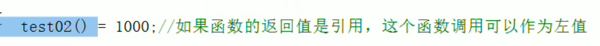
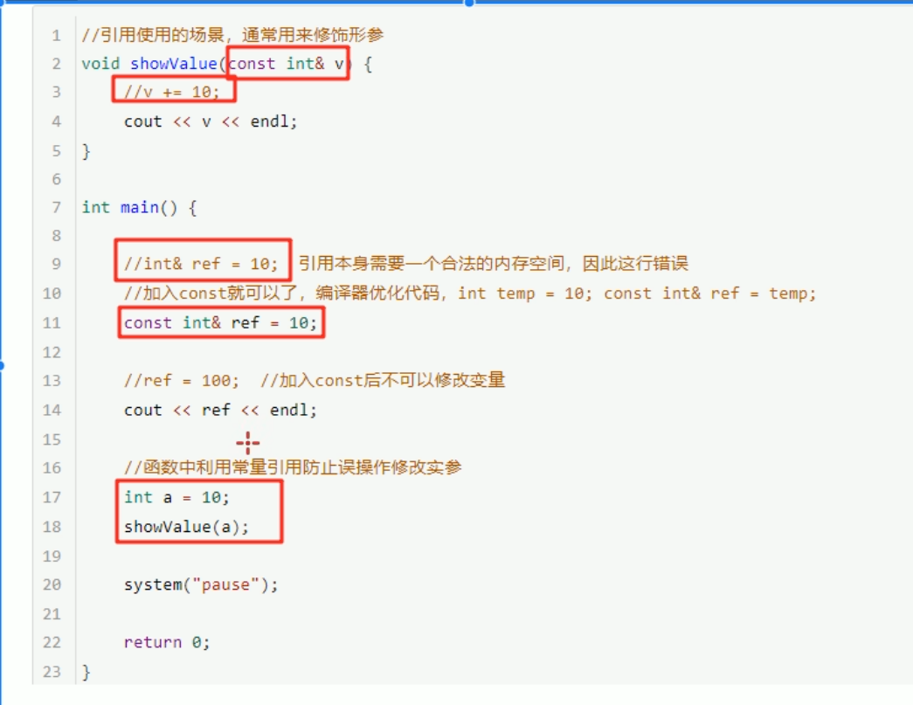

# 本质 给变量起别名

语法：数据类型 &别名 = 原名 

    int &b = a;
    b = 20;
    cout << a;

a,b操作的是同一块内存

## 引用的注意事项

引用必须在定义时初始化  

    int &b;//错的
    int a = 10;
    int &b = a;

引用一旦初始化后，不可更改

    int &b = a;
    &b = c;//不行

## 引用作为函数参数

不再生成复制实例，提高程序效率  
引用传递(给变量起别名，对别名的修改就是对本身的修改)
优点：简化指针修饰代码  

    int myswap(int &a, int &b);

## 引用作函数的返回值

*不要返回局部变量的引用*  
函数执行完，变量的内存已经被释放

函数的调用可以作为左值
  

    int & test()
    {
        static int a = 10;
        return a;
    }

    test() = 1000;

则返回1000

    int& ref = a;

    int* const ref = &a;

自动转换为后者，const修饰的是指针的指向不可改（指针常量），但指针指向的地址中存放的内容可以改  

结论：C++推荐使用引用技术，语法方便，引用本质是指针常量，但所有的指针操作编译器都帮我们做了  

## 常量引用

作用：主要用来修饰形参，防止误操作  
在函数形参列表中，加 const修饰符，防止形参改变实参  

    int a(const int &s);

引用必须引一块合法的空间  

    int a = 10;
    int & ref = 10;//错，10是一个常量，在程序中没有占用具体的空间。

    const int & ref = 10;
    这个对
加const后，编译器将代码修改为

    int temp = 10;
    const int & ref = temp;

由于是 const 修饰， ref= 20;错误，ref只读，不能修改  
  
