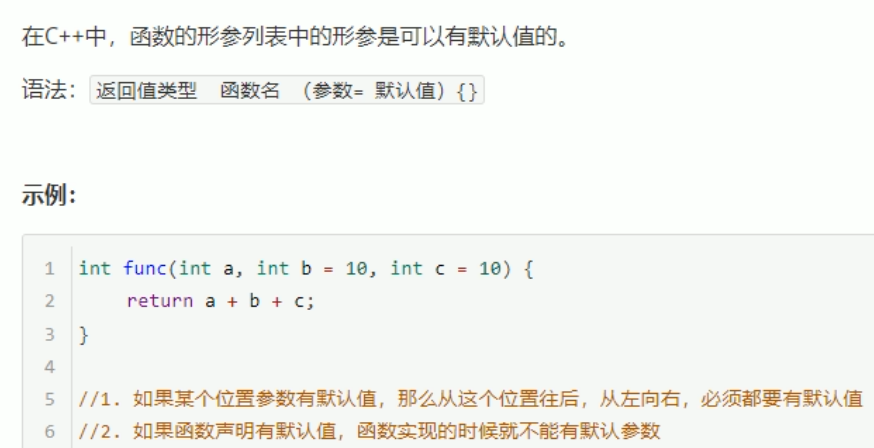
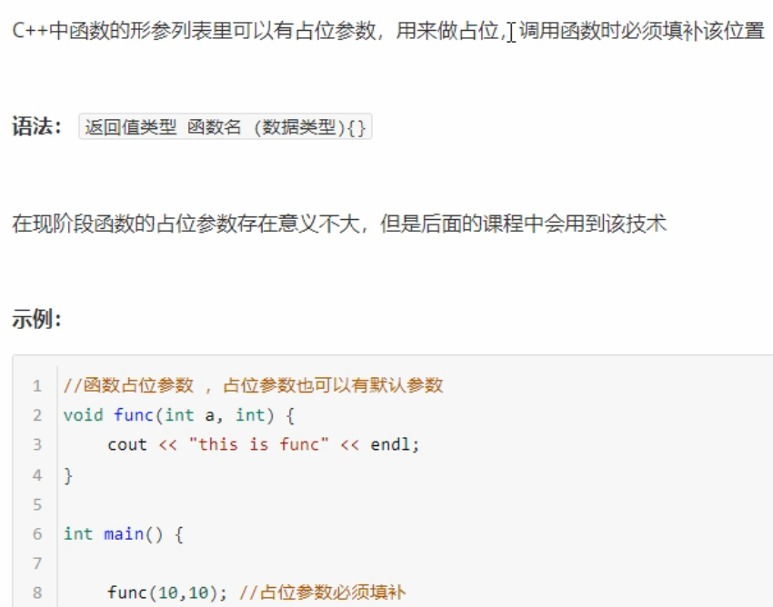
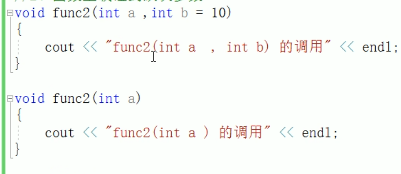
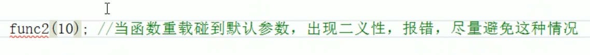

# 函数提高

## 1 函数默认参数

  

函数声明和定义（实现），只能有一个有默认值，否则程序出现二义性。

## 2 函数占位参数

形参列表中的使用
  

## 3 函数重载

作用：函数名可以相同，提高复用性  

***函数重载满足的条件***

>1. 同一个作用域下
>2. 函数名称相同
>3. 函数参数*类型不同*，或*个数不同*或*顺序不同*  

### 函数重载的注意事项

引用作为重载条件  
参数列表中有没有const 可以作为重载的条件  

函数重载碰到函数默认参数  
  
  

