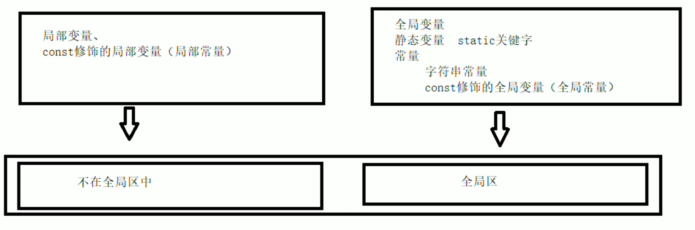

# 核心编程

面向对象

## 1 内存分区模型

C++程序执行时，内存大方向划分为4个区

>1. 代码区：存放函数体二进制代码，操作系统管理  
>2. 全局区：存放全局变量和静态变量及常量
>3. 栈区：编译器自动分配释放，存放函数的参数值、局部变量
>4. 堆区：程序员分配和释放，若程序员不释放，操作系统管理

赋予不同的生命周期，给更大的灵活编程  

### 1.1 程序运行前

exe还没运行前 分为两个区域  

代码区：存放CPU的机器指令  
特点：共享的（频繁执行的代码，内存中只有一个就行），只读的  
全局区：全局变量、静态变量，常量（字符串常量、const修饰的变量（全局、局部））存放  
该区域数据在程序结束后由操作系统管理释放  

  

### 1.2 程序运行后

栈区（存放什么）：由编译器自动分配释放，存放函数参数值，局部变量  
*注意：不要返回局部变量地址，栈区开辟的数据由编译器自动释放*  

### 1.3 new操作符

堆区：主要利用new在堆区开辟内存  
程序员不释放，堆区的数据在程序运行过程中就一直不释放。  

语法：new 数据类型  
new 返回的是该类型的指针

    int *p = new int(10);
    delete p;

堆区开辟数组  

    int *p = new int[10];
    delete [] p;//记得中括号

