# 类和对象

C++面向对象的三大特性：封装、继承、多态
对象上有其属性和行为；具有相同性质的对象，可以抽象为类。  

## 1 封装

### 1.1 封装的意义

> 将属性和行为作为一个整体，表现生活中的事物，称为类中的*成员*
> 将属性和行为加以权限控制

访问权限有三种：
>公共权限 public 类内可以访问 类外可以访问
>保护权限 protected 类内可以访问 类外不可以访问
>私有权限 private 类内可以访问 类外不可以访问

保护权限和私有权限在继承中有区别  
子类可以访问父类保护权限的内容，不能访问私有权限的内容

### 1.2 struct和class的区别

其实没啥区别，都可以表现一个类
区别：默认的访问权限不同  

> struct 默认权限是 public
> class 默认权限是  private  

### 1.3 成员属性设置为私有

优点

>1. 将所有成员属性设置为私有，可以自己控制读写权限  
>2. 对于写权限，可以检测数据的有效性  

## 2 对象的初始化和清理

### 2.1 构造函数和析构函数

对象的初始化和清理是编译器强制的，如果我们自己不提供，编译器会提供。编译器提供的构造函数和析构函数是空实现  
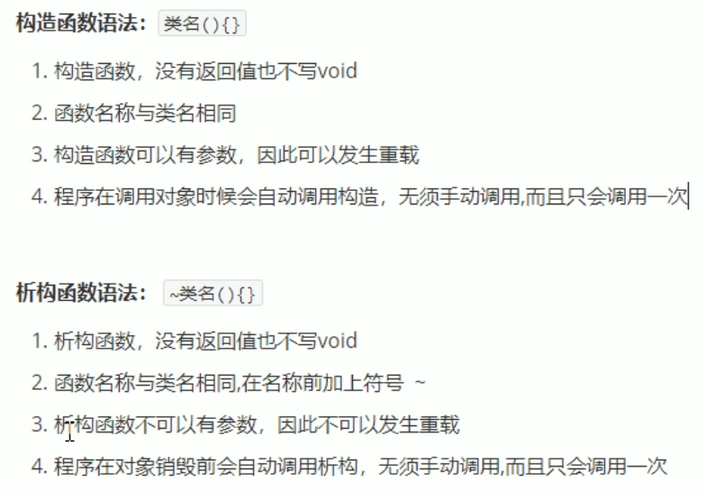  

### 2.2 构造函数的分类及调用

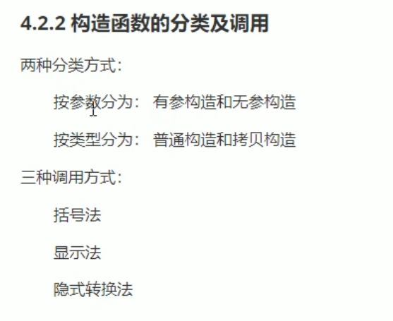  

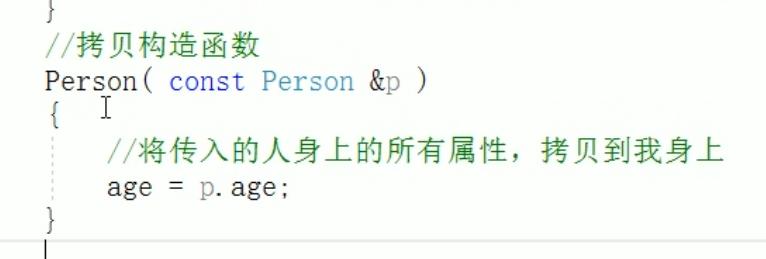

注意，拷贝构造函数的写法  

显示法进行构造
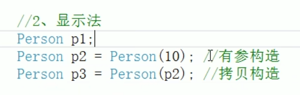  

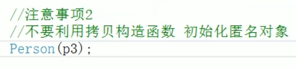  

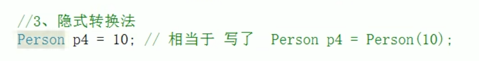  

### 2.3 拷贝构造函数调用时机

1. 使用一个已经创建完毕的对象来初始化一个新对象  
2. 值传递的方式给函数参数传值  
3. 值方式返回局部对象  

### 2.4 构造函数调用规则

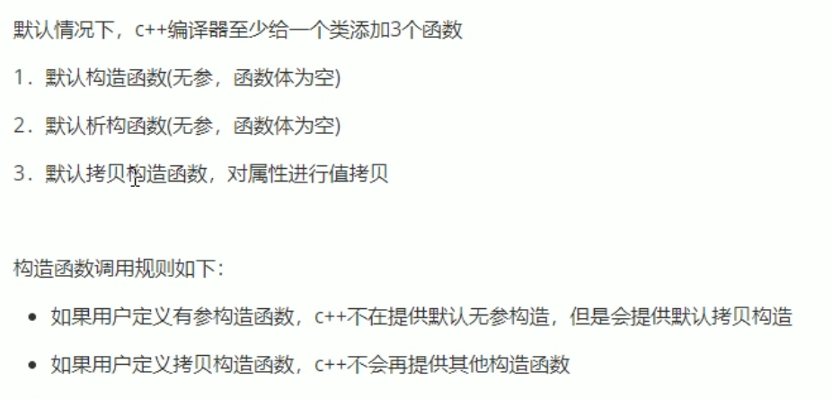  

### 2.5 深拷贝与浅拷贝

  

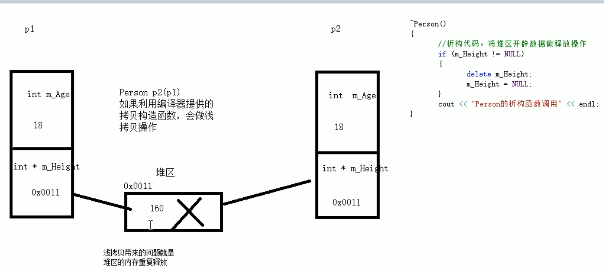  
默认提供的是浅拷贝：可能有堆区的内存重复释放问题  

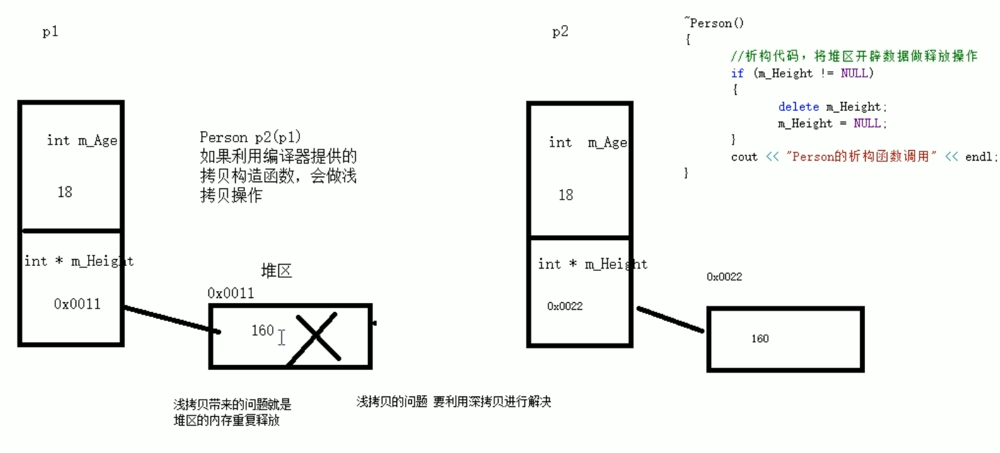  

深拷贝，重新在堆区再创建一块内存  
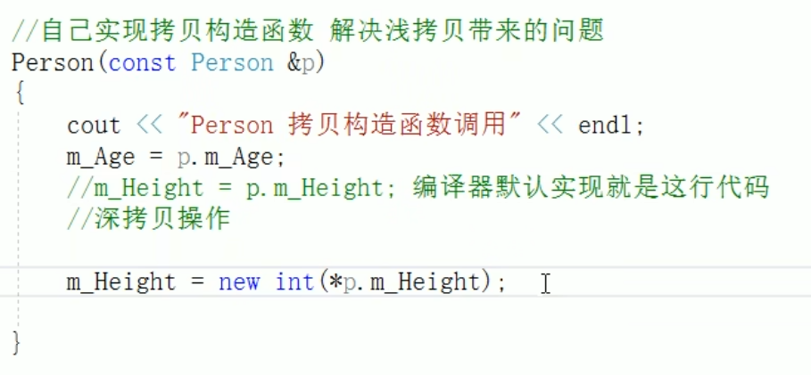  

***如果属性有在堆区建立的，一定要自己提供拷贝构造函数，防止浅拷贝带来的问题***  

### 2.6 初始化列表

给类中的对象一种初始化的操作  
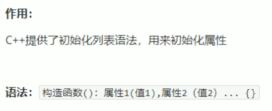  

注意冒号的位置：构造函数形参列表后

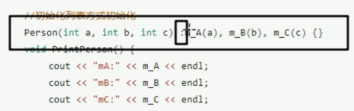  

### 2.7 类对象作为类成员

C++中类的成员可以是另一个类的对象  
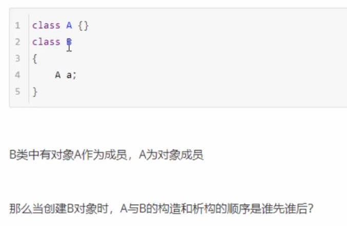  

构造时，先构造对象成员，再构造自身。（构造对象成员是构造自身的基础）  

### 2.8 静态成员

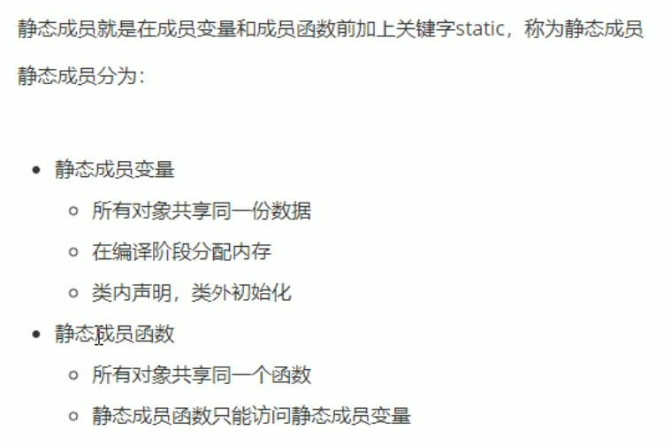  

类内声明，类外初始化  
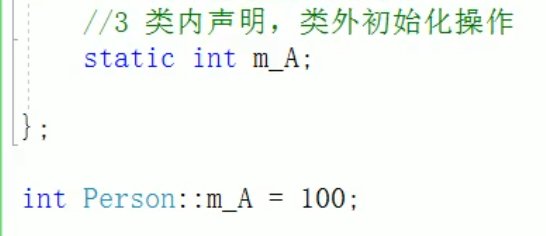  

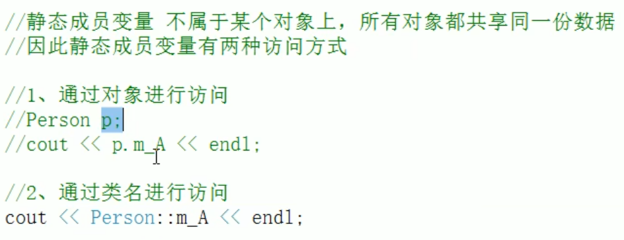  
