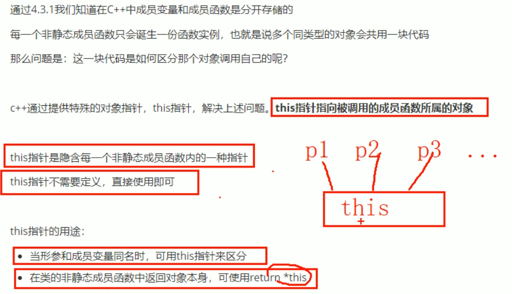
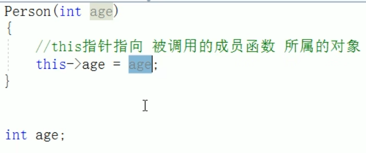
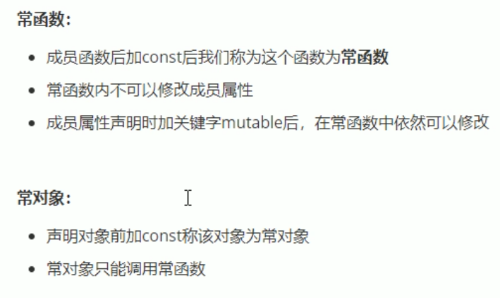

# 类和对象

## 3 C++对象模型和this指针

### 3.1 成员变量和成员函数分开存储

只有非静态成员变量才属于类的对象  

### 3.2 this指针概念

1. 解决名称冲突  
2. 返回自身

  
  

### 3.3 空指针访问成员函数

如果成员函数中不涉及对成员变量（属性）的使用，可以的。  
但如果涉及，由于本身为空指针，根本没有对应的对象，会报错。  

### 3.4 const修饰成员函数

  
