# 类和对象

## 5 运算符重载

对于内置的数据类型的表达式的运算符是不能改变的  

已有的运算符进行重新编程，以适应不同的数据类型。

### 5.1 加号运算符重载

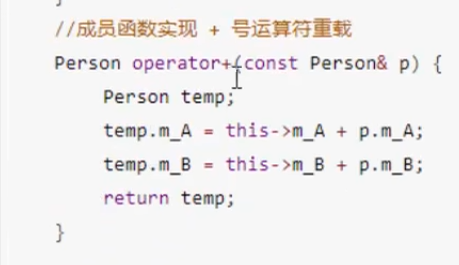  
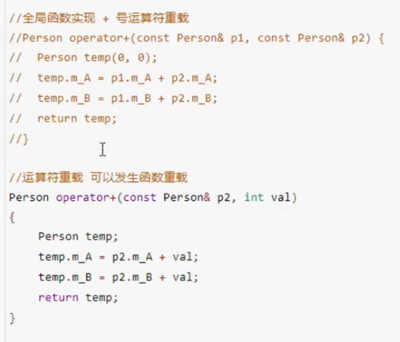  

### 5.2 左移运算符重载

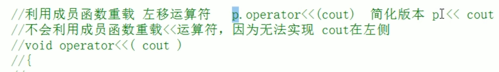  

只能用全局函数重载左移运算符  
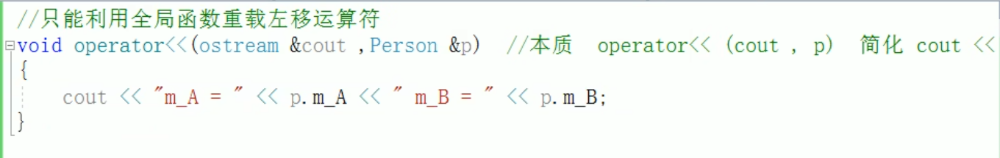  
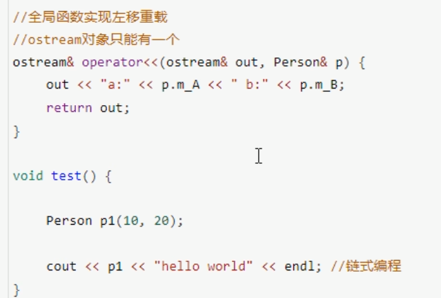  

左移运算符重载+友元 实现对自定义数据类型的输出  

### 5.3 递增运算符重载

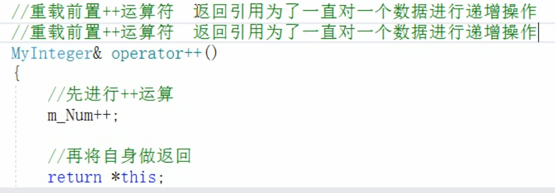  

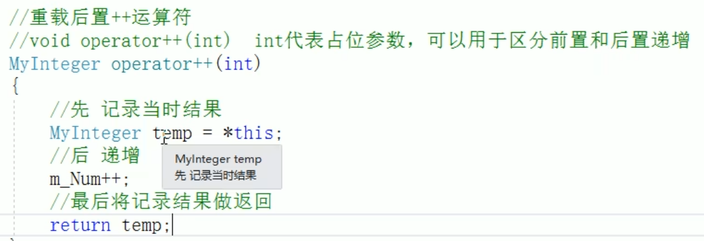  
后置递增一定要返回值，不能返回引用。因为函数结束时temp就会被释放。  

### 5.4 赋值运算符重载

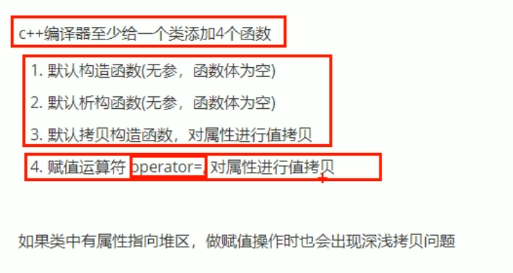  

用到堆区时，使用默认的会导致堆区内存重复释放，考虑深拷贝浅拷贝的问题  

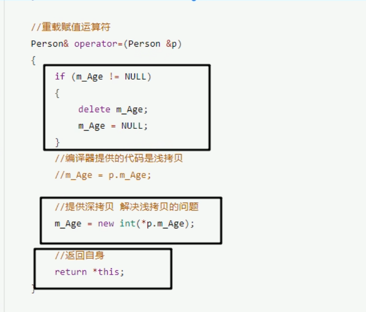  

### 5.5 关系运算符重载

可以令两个自定义数据类型进行比较  
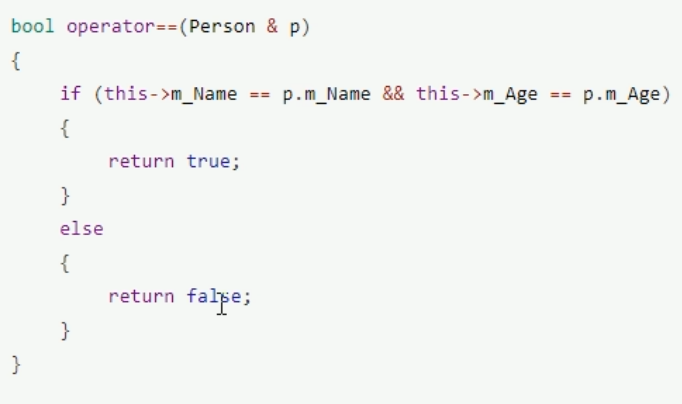  

### 5.6 函数调用运算符重载
函数调用运算符() 由于很像函数调用，称为仿函数
匿名对象  
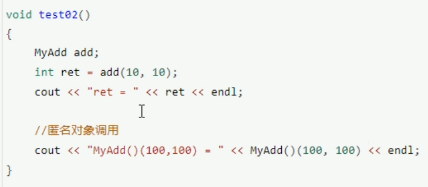
