# 类与对象

## 继承

继承：面向对象三大特性之一  
下级别有上级别的共性，以及自己的特点  
好处：减少重复的代码  

### 1 继承的基本语法

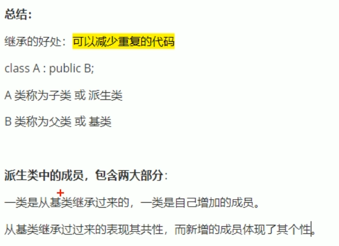  

### 2 继承方式

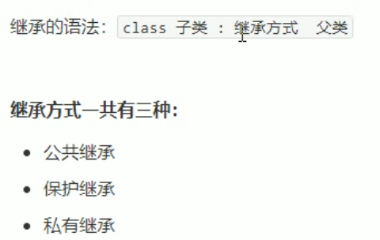  

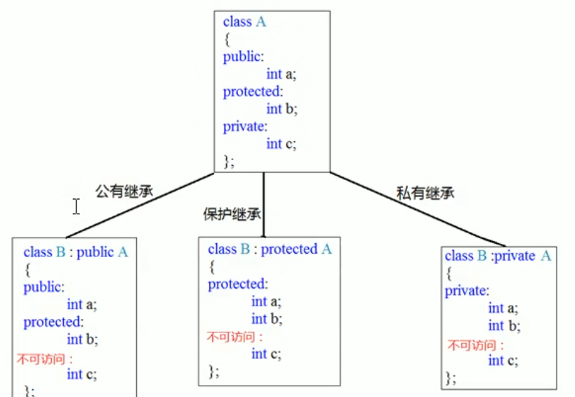  

父类中private，无论哪种继承方式都不能访问  
公共继承：父类能访问的权限也是子类的权限  
保护继承：子类能访问的权限全为protected  
私有继承：子类能访问的权限全为private  

### 3 继承中的对象模型

问题：从父类继承过来的成员，哪些属于子类对象中  

父类中所有非静态成员属性都会被子类继承下去  
父类中私有成员属性，是被编译器隐藏了，访问不到但确实继承了

### 4 继承中构造和析构顺序

子类继承父类后，当创建子类对象，也会调用父类对象  
问题：父类和子类的构造和析构顺序

构造：先父类，再子类  
析构：先子类，再父类  

### 5 继承同名成员处理方式

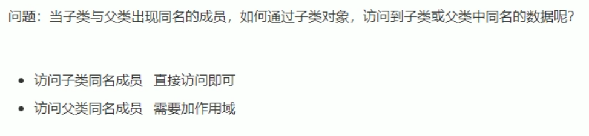  
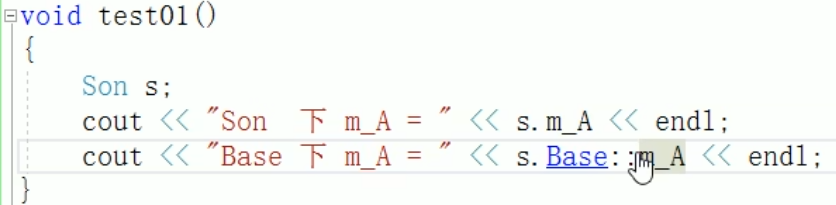  
如果通过子类对象访问父类的同名成员属性，需要写上作用域  

成员函数  
  
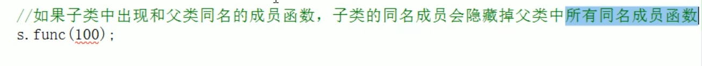  

### 6 继承同名静态成员处理方式

主要有两种访问方法  

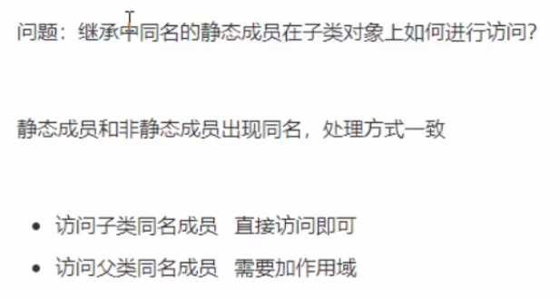  

静态成员属性与对象无关，所以可以直接通过类名访问  

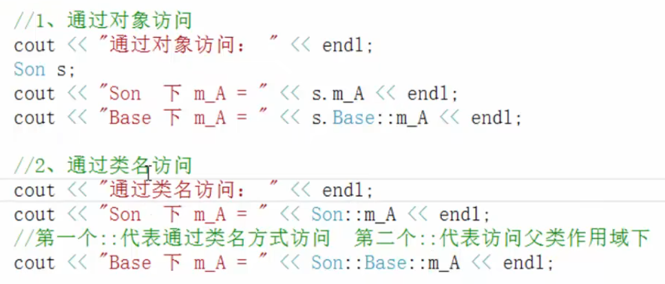  

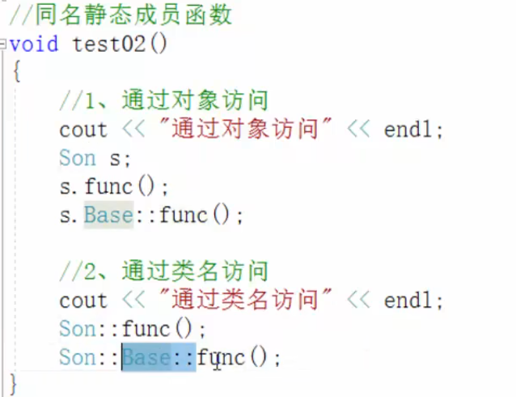  

同理，子类中出现和父类同名的成员函数，子类的同名成员会隐藏父类中所有同名成员函数  

### 7 多继承语法

加作用域区分不同父类的同名成员  

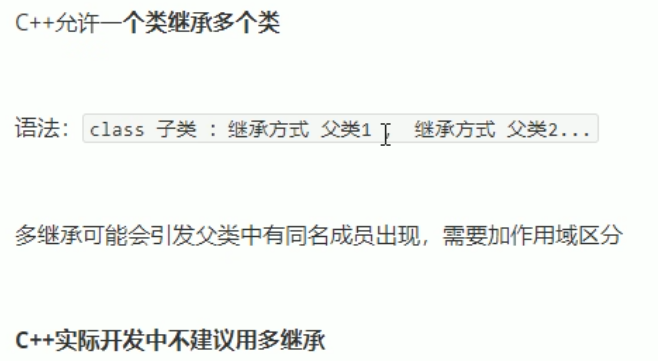  

### 8 菱形继承

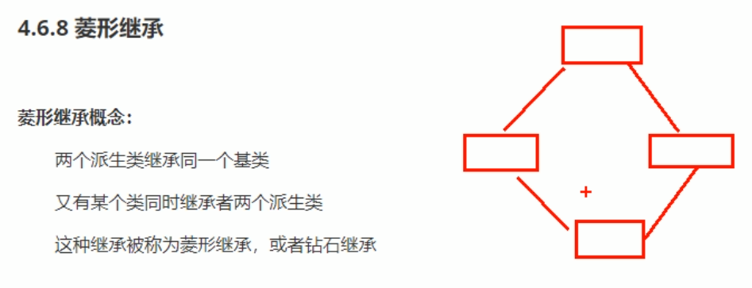  
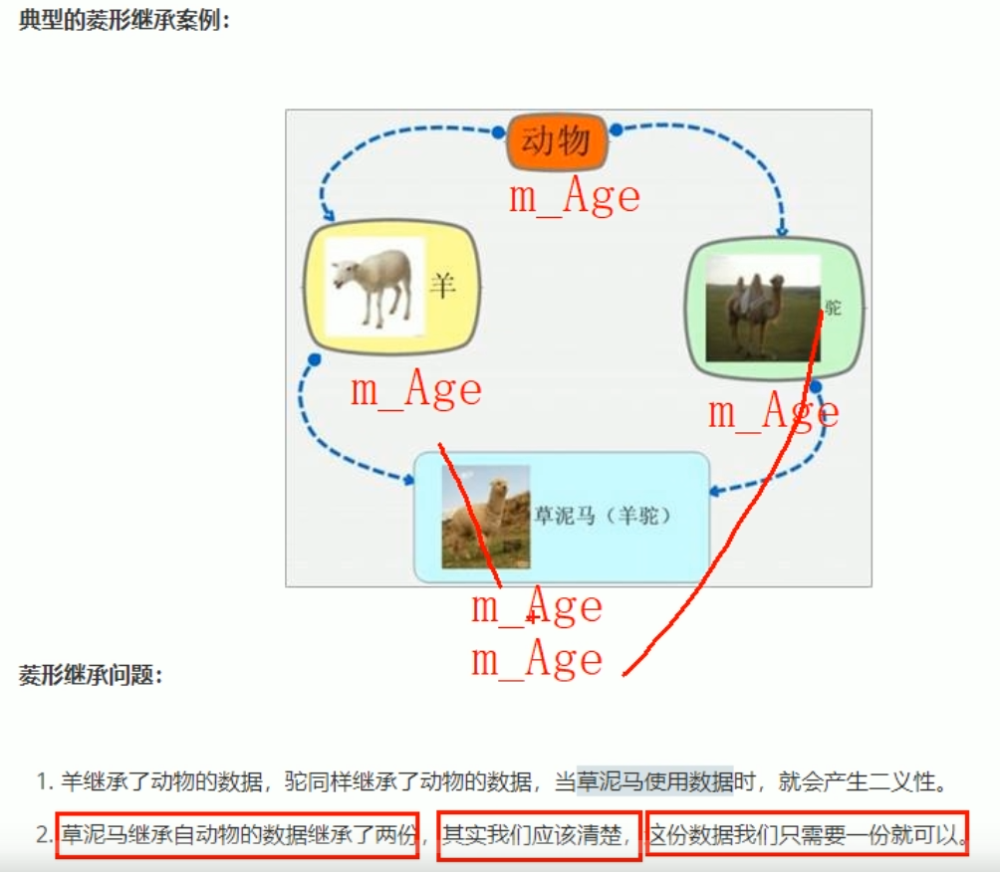  

利用虚继承，可以解决菱形继承问题  

虚继承，此数据只有一个  
虚基类指针 虚基类表  
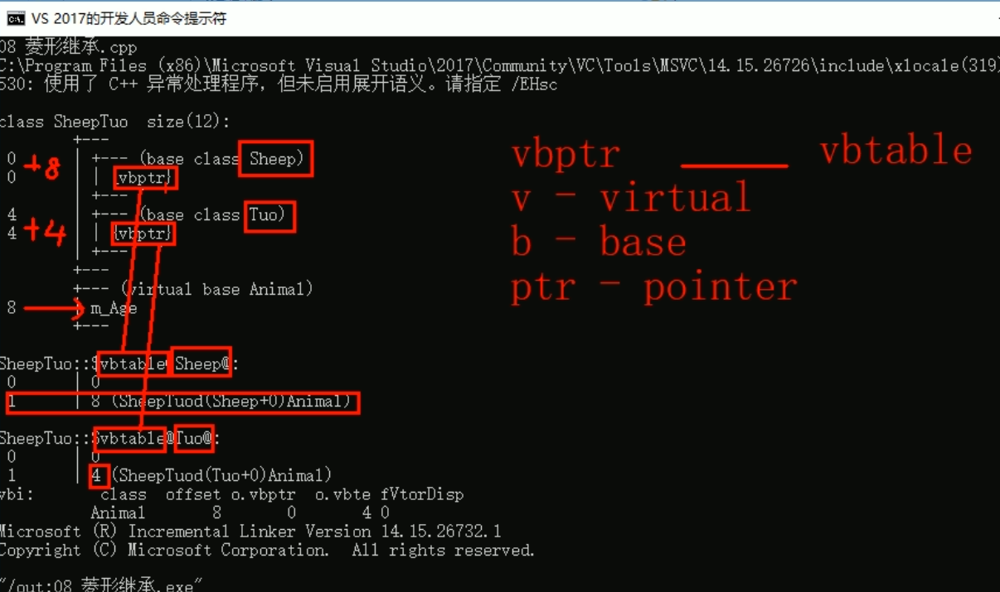  
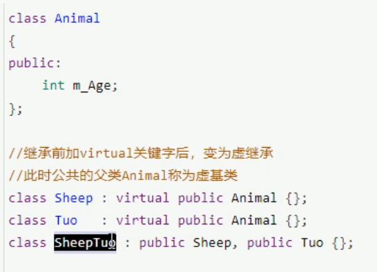  
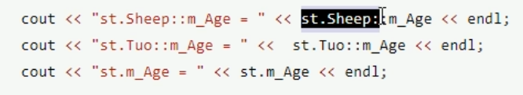  