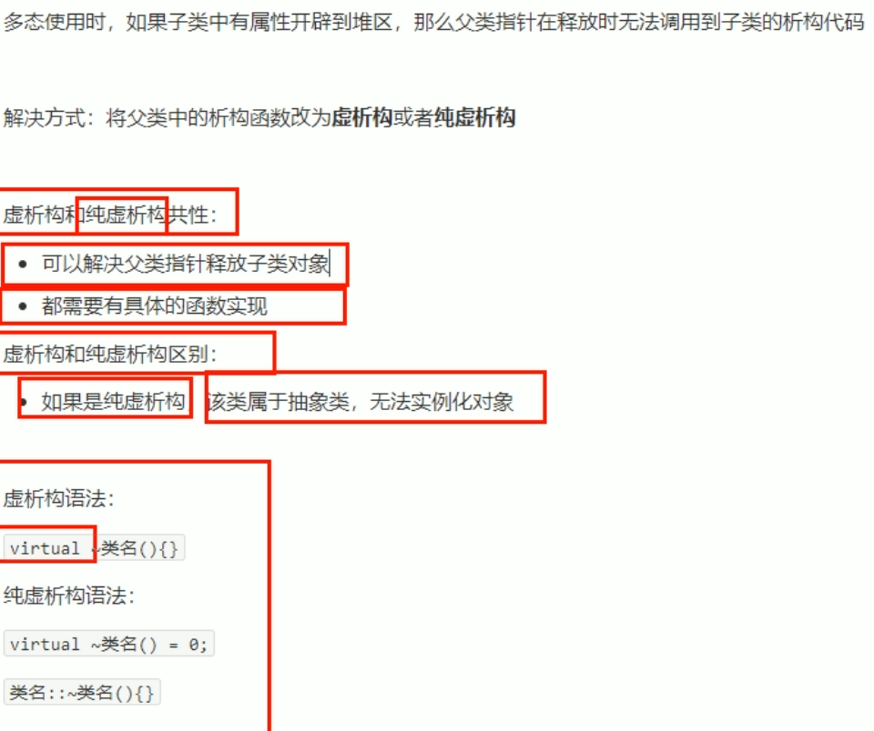

# 类与对象

## 多态

### 1 多态的基本概念

  

  
结果是动物在说话，编译阶段就已经确定函数地址  

  
在动物类中，对speak（）函数添加 virtual 关键字  

动态多态满足条件

1. 有继承关系  
2. 子类要重写父类中的虚函数（重写与重载不同。重载：函数名相同，参数列表不同；重写：函数名，参数列表都相同，父子类的一个概念） 

动态多态使用：父类的指针或引用，执行子类对象  

### 2 多态案例一：计算器类

  

### 3 纯虚函数和抽象类

  

类中有了纯虚函数，这个类称为抽象类，  

### 4 虚析构和纯虚析构

  
  

方法：将父类中析构函数改为 virtual 关键字  
  
