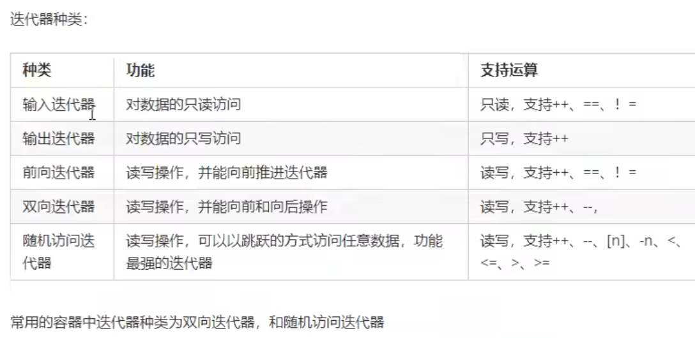
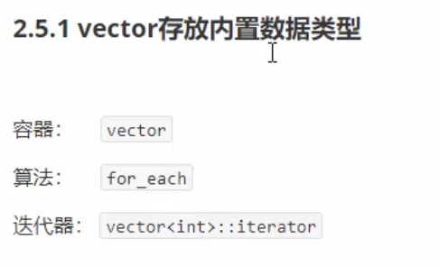

# STL初识

面向对象：封装、继承、多态  
泛型编程：模板  
大多情况下，数据结构和算法都未能有一套标准，导致被迫进行大量重复工作  
为了建立数据结构和算法的一套标准，诞生了STL  

## STL基本概念

>1. STL(Standard Template Library, 标准模板库)  
>2. STL 从广义上分为：***容器(container)算法(algorithm)迭代器(iterator)***  
>3. ***容器***和***算法***之间通过***迭代器***进行无缝连接  
>4. STL几乎所有的代码都采用了模板类或者模板函数  

### STL六大组件

STL大体分为六大组件，分别是***容器、算法、迭代器、仿函数、适配器（配接器）、空间配置器***  

> 容器：各种数据结构，如vector、list、deque、set、map 等
> 算法：常用算法，如sort、find、copy、for_each 等  
> 迭代器：扮演了容器与算法之间的胶合剂  
> 仿函数：行为类似函数，可作为算法的某种策略  
> 适配器：用来修饰容器或迭代器或仿函数的接口  
> 空间配置器：负责空间的配置与管理

### STL中容器、算法、迭代器

容器：放东西的
STL容器就是将运用最广泛的数据结构实现出来：数组、链表、树、栈、队列、集合、映射表等  

序列式容器：强调值的排序，容器中每个元素有固定的位置  
关联式容器：二叉树结构，各元素之间没有严格物理上的顺序  

算法：问题的解法  
有限的步骤解决逻辑或数学上的问题  
分为：质变算法和非质变算法  
质变算法：指运算过程中会更改区间内元素的内容，如拷贝、替换、删除  
非质变算法：指运算过程中不会更改区间内元素的内容，如查找，计数，遍历等  

迭代器：容器和算法之间的粘合剂  
提供一种方法，使之能够依序寻访某个容器所含的元素，而又无需暴露该容器的内部表示方式  
每个容器都有自己专属的迭代器  
（迭代器使用非常类似于指针，初学阶段可以先理解为指针）  
  

### 容器算法迭代器初始

  

