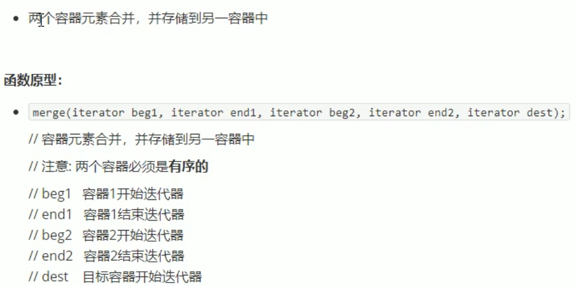

# STL 常用算法

  

## 1 常用遍历算法

常用遍历算法：  
> for_each 遍历容器  
> transform 搬运容器到另一个容器中  

  

普通函数，只放函数名就行；仿函数，要加小括号(函数调用操作符)  

  

搬运过程中，还可以对这些数据进行一些 _func 运算  
搬运的目标容器必须提前开辟空间  
  
  
  

## 2 常用查找算法

  
  
  
  
  
  

## 3 常用排序算法

  
  
  
  
merge两个容器必须是有序的  
  

## 4 常用拷贝和替换算法

  
  
  
  
  

## 5 常用算术生成算法

  

累加算法 accumulate  
  

fill 填充  
  

## 6 常用集合算法

  
  

  
  
  

  
差集分方向  
  
  
