# deque容器

双端数组，可对头端进行插入删除操作  

## 1 deque容器基本概念

deque与vector区别：
> vector对于头部的插入删除效率低，数据量越大效率越低
> deque相对而言，对头部的插入删除速度比vector快
> vector访问元素时的速度会比deque快

和两者内部实现有关

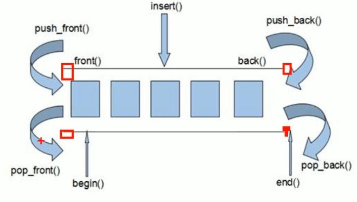  

中控器的结构，使得其 *像* 一个连续地址  
deque容器的迭代器，支持随机访问  
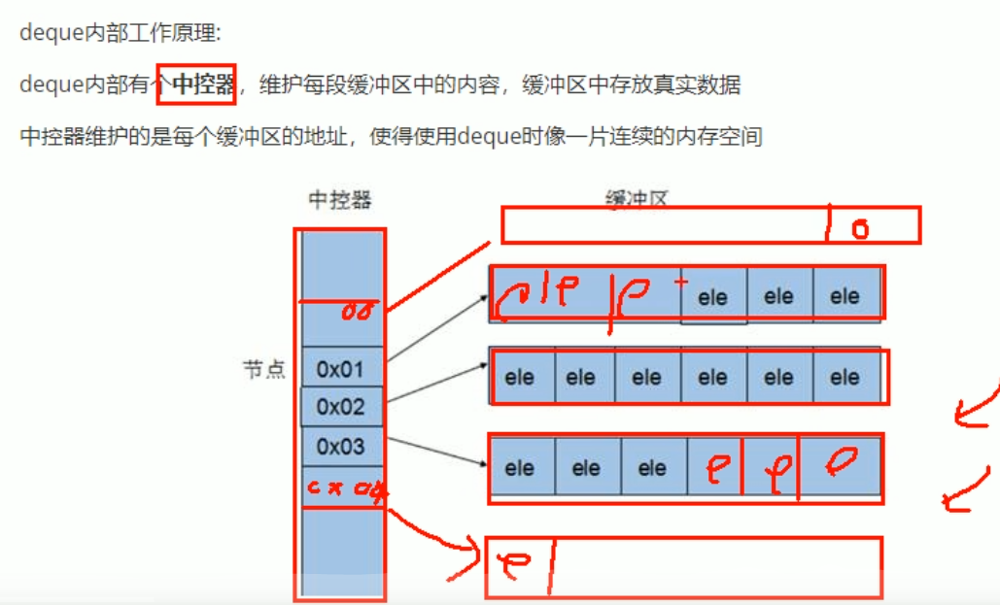  

## 2 deque构造函数

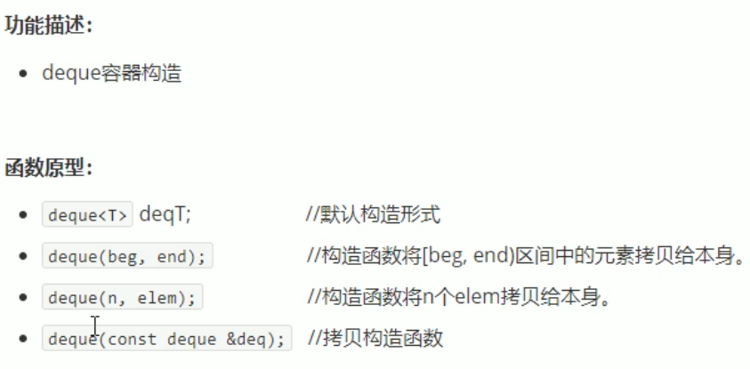  

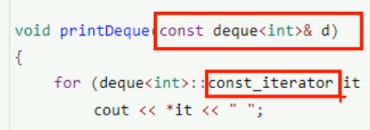  
如果想限制为只读，迭代器也要用只读迭代器  

## 3 deque赋值操作

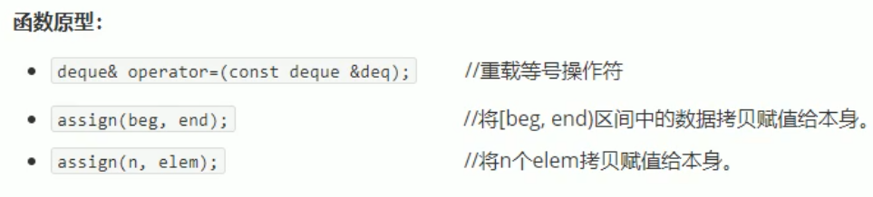  

## 4 deque大小操作

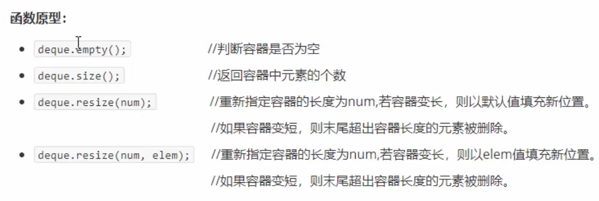  
***deque没有容量的概念，可以无限的扩容量***  

## 5 deque插入和删除

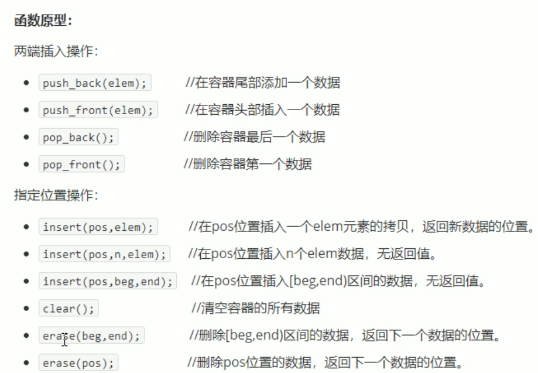  

不从开头开始删，建一个迭代器
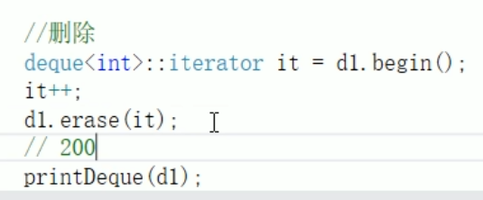

## 6 deque数据存取

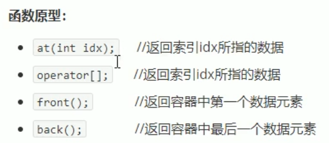  

## 7 deque排序

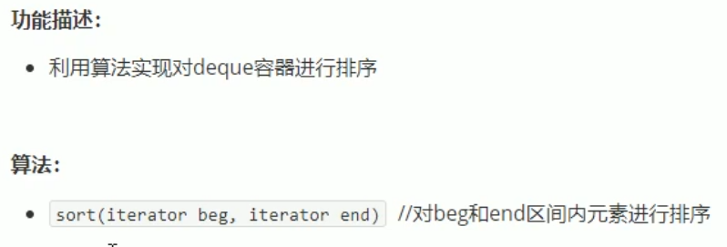  

    include<algorithm>

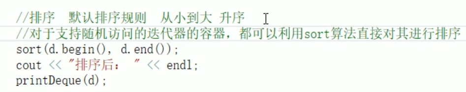  
