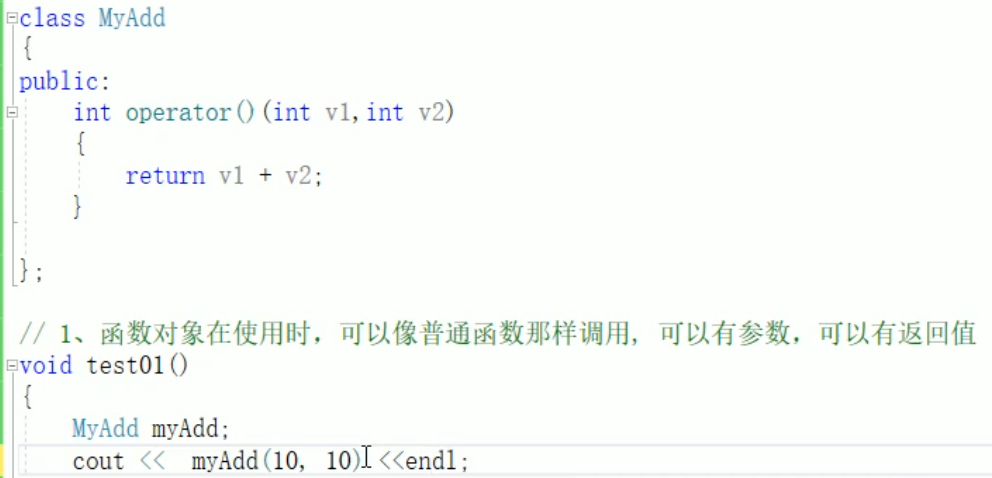
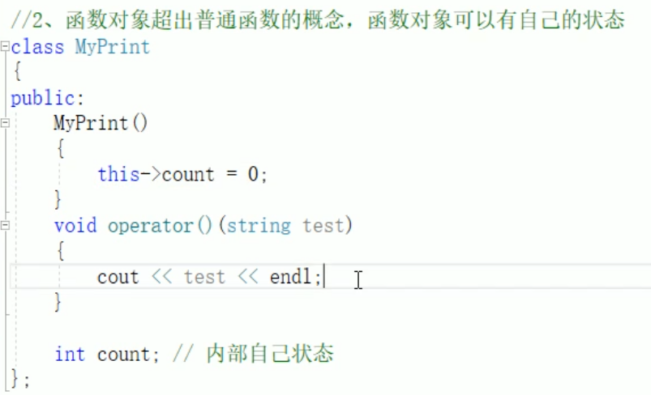
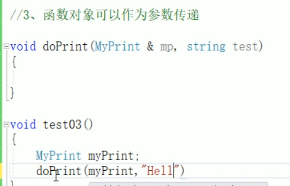

# STL函数对象

仿函数

## 1 函数对象概念

概念：  
> 重载 *函数调用操作符* 的*类*，其对象常称为函数对象  
> 函数对象使用重载的()时，行为类似函数调用，也叫仿函数  

本质：  
函数对象(仿函数)是一个类，不是一个函数  

## 2 函数对象使用

特点：  
> 函数对象在使用时，可以像普通函数那样调用，可以有参数，可以有返回值  
> 函数对象超出普通函数的概念，函数对象可以有自己的状态  
> 函数对象可以作为参数传递  

像普通函数一样使用
  

可以有自己的状态  
构造函数的定义：只有创建对象时，才会调用构造函数。  因此不是每次给对象传参都会使 count 加1  
  

函数对象可以像参数一样传递  
  

