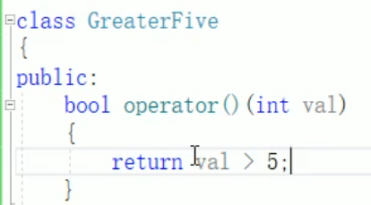
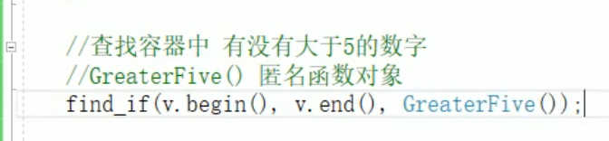

# 谓词

## 1 谓词概念

概念：  
> 返回 *bool类型* 的仿函数称为 *谓词*  
> 如果operator（）接受一个参数，那么叫做一元谓词  
> 如果operator（）接受两个参数，那么叫做二元谓词  

## 2 一元谓词

find_if 三个参数：begin end Pred谓词  

  

  

匿名函数对象  

## 3 二元谓词

使用 头文件algorithm 中的 sort() 算法  
