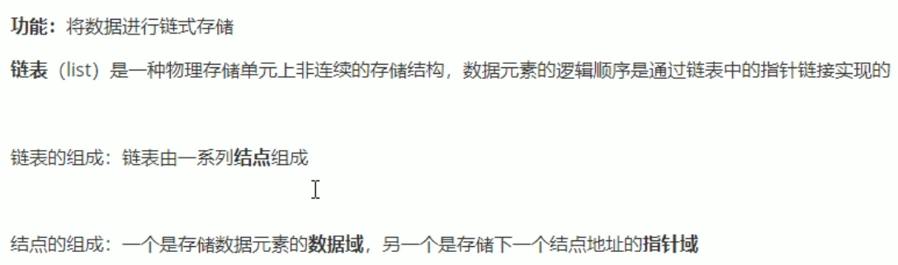
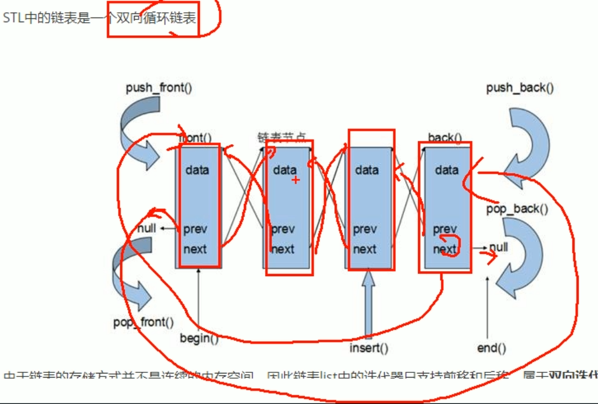
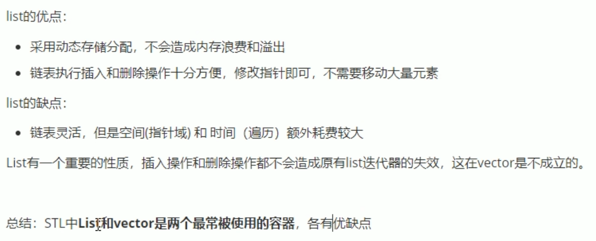
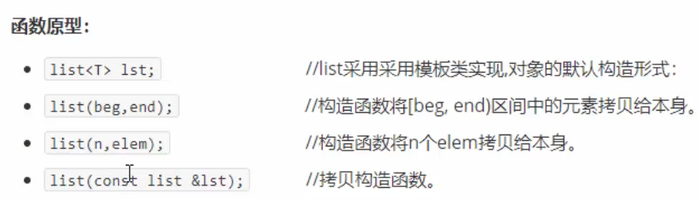
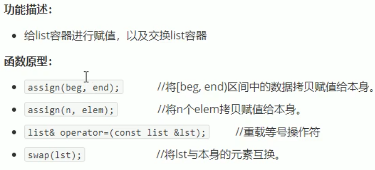
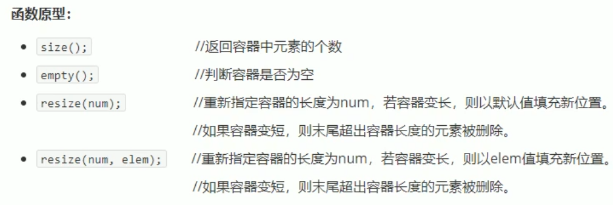
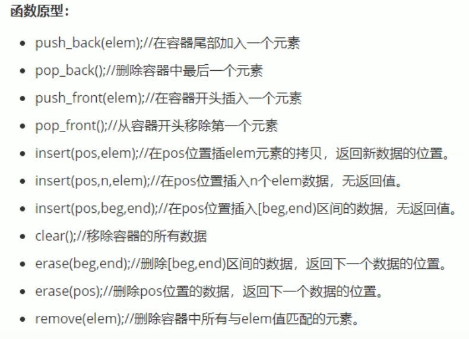
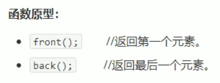
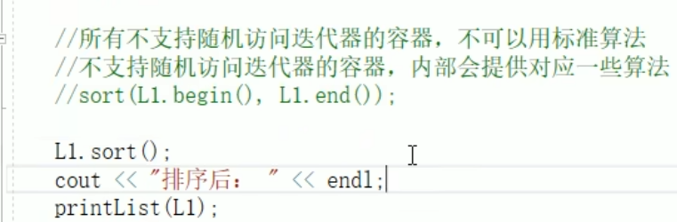
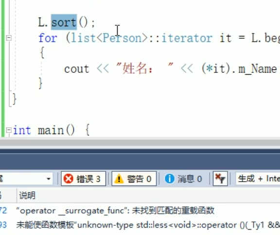

# list 链表

  

## 1 list基本概念

  

双向迭代器，不是随机访问迭代器  

  

## 2 list构造函数  

  

## 3 list赋值和交换  

  

## 4 list大小操作  

  

## 5 list插入和删除

  

## 6 list数据存取

  
没有中括号和at，数据结构是链表，不是连续的空间，也不是随机访问迭代器，所以没有这两种方法  

## 7 list反转和排序

  
  
默认排序规则，从小到大，  

## 8 排序案例

  

自定义的数据类型，必须要指定排序规则  
通过sort参数中函数参数或仿函数确定  

  