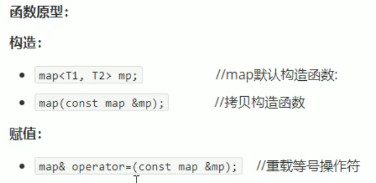
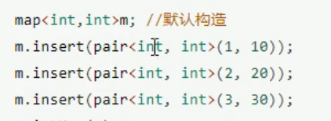
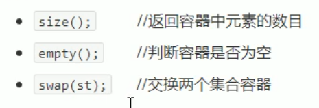
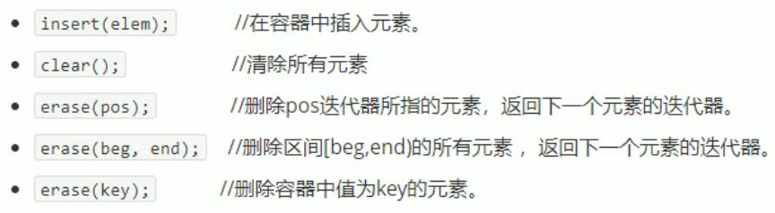
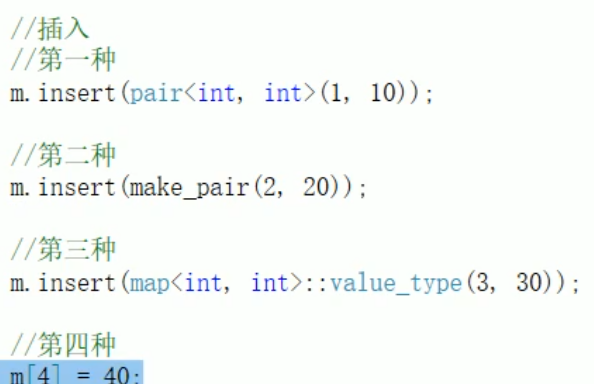
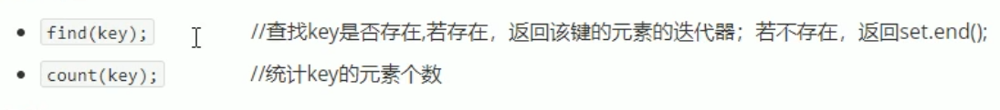
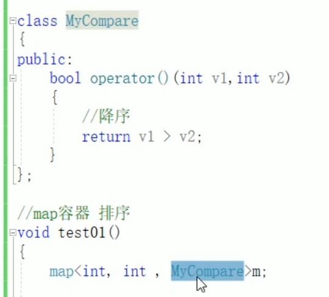

# map、multimap容器

## 1 map基本概念

简介
> map中所有元素都是pair
> pair中第一个元素为key(键值)，起索引作用，第二个元素为value(实值)
> 所有元素都会根据元素自身的键值自动排序

本质
map/multimap属于关联式容器，底层结构二叉树实现  

优点  
可根据key快速找到value  

两者区别：允许有重复key值元素，不允许有重复key值元素  

## 2 map构造和赋值

  
  
map中所有数据成对出现，插入时一定用pair  

## 3 map大小和交换

  

## 4 map插入和删除

  
  

## 5 map查找和统计

  

## 6 map容器排序

  
第三个就是排序类型规则  
