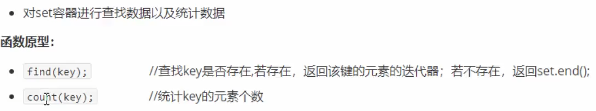
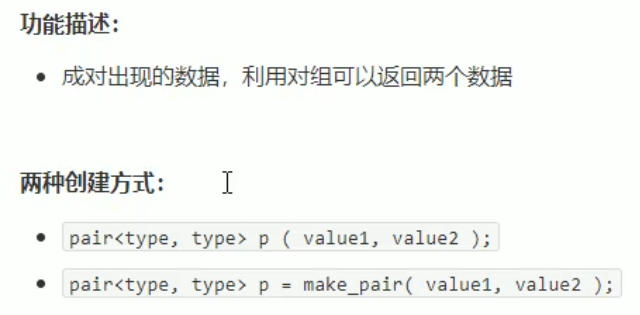

# set/multiset容器

***集合类容器：所有元素都会在插入时被自动排序***  

## 1 set基本概念

本质：属于关联式容器，底层由二叉树实现  

set/multiset  
> set不允许容器中有重复的元素  
> multiset允许容器中有重复的元素  
包含头文件时，只包含set就行  

## 2 set构造和赋值

  

set容器不允许插入重复值  

  

## 3 set大小和交换

  
没有resize，（resize多的时候填什么呢？默认值？不允许重复元素）  

## 4 set插入和删除

  

## 5 set查找和统计

返回的结果是迭代器  

  
  

## 6 set和multiset区别

  
  

## 7 pair对组创建

不需要包含头文件  

  
  

## 8 set容器排序

  

仿函数：重载小括号  

### 存放内置数据类型时  

  

定义时，就要包含指定的仿函数  

  

### 存放自定义数据类型时  

  
  
