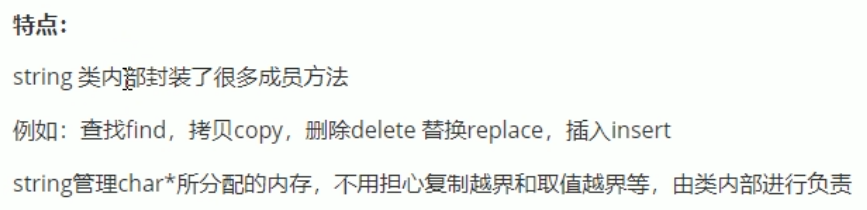
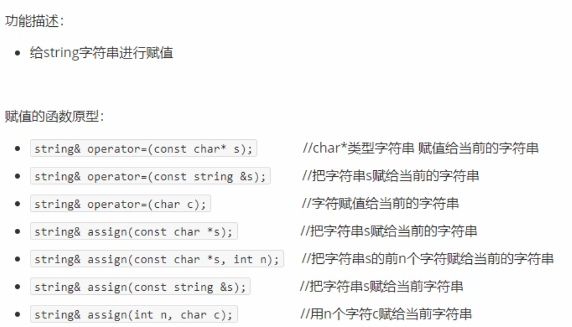
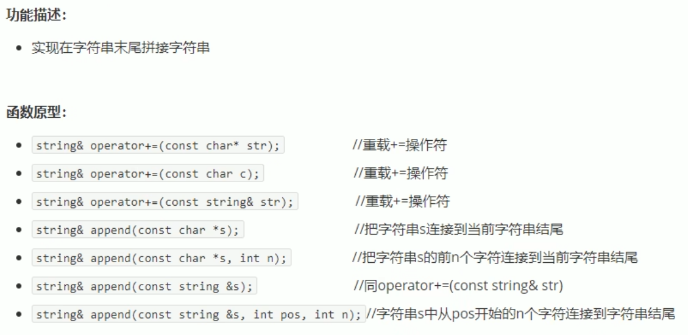
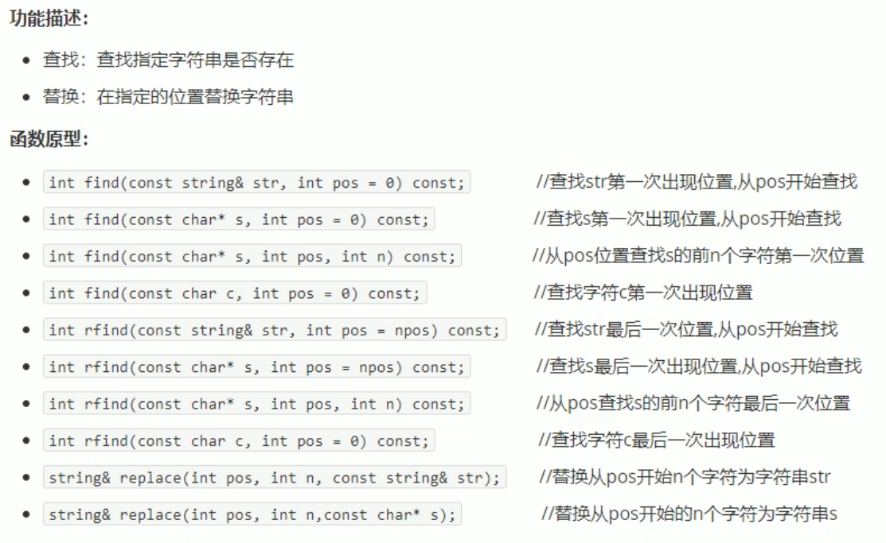
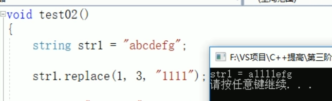
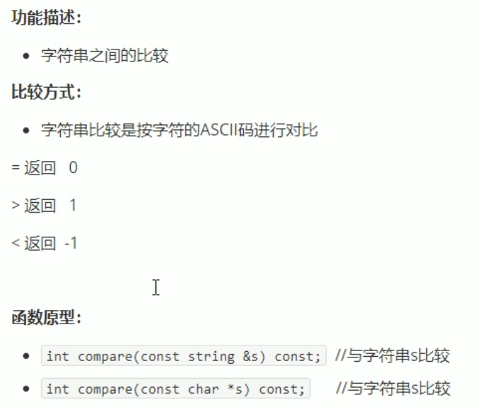
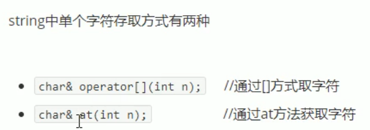
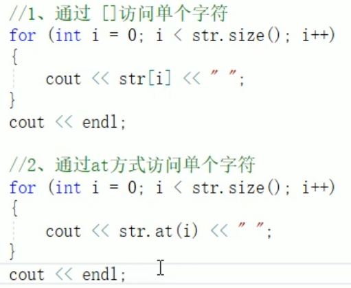
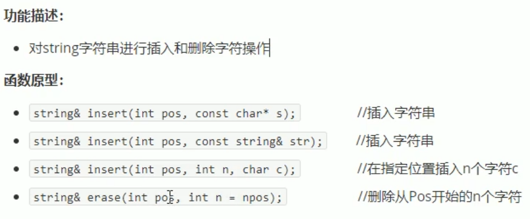
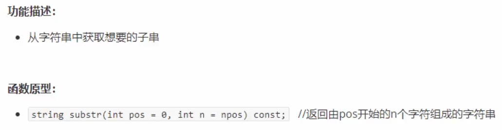

# string 容器

C++风格的字符串， string本质是一个类

## 1 string的基本概念

char * 是一个指针
string是一个类，类内部封装了 char* ，管理这个字符串，是一个 char*型的容器  

  

## 2 string构造函数

    string();                       //创建空字符串，string str；
    string(const char* s);          //使用字符串s初始化
    string(const string& str);      //使用一个string对象初始化另一个string对象
    string(int n, char c);          //使用n个字符c初始化

## 3 string赋值操作

初始化后，也可以重新赋值
  

    string str1("string!!");
    string str.assign(str1);

## 4 string字符串拼接

  

## 5 string查找和替换

  
  

## 6 string字符串比较

  

## 7 string字符存取

  
  

两种方式 ***可读可写***

## 8 string插入和删除

  
从哪个位置起，插入、删除。。。

## 9 string子串

  
