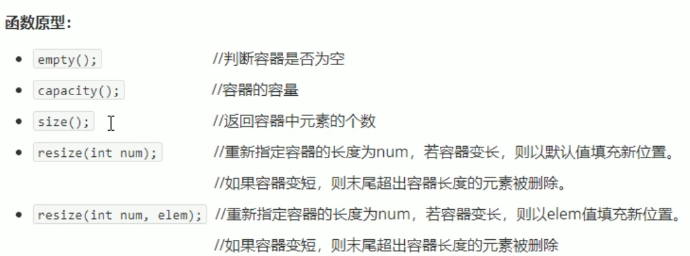

# vector 容器

## 1 vector基本概念

vector数据结构和 ***数组*** 非常相似，称为 ***单端数组***  
只能在数组尾端push pop  

区别：数组是静态空间，而vector是 ***动态扩展***  
动态扩展：不是在原空间之后续接新空间，而是找更大的内存空间，然后将原数据拷贝新空间，释放原空间。  

  

> vector容器的迭代器是支持随机访问的迭代器  

## 2 vector构造函数

  

## 3 vector赋值操作

  

## 4 vector容量和大小

  

## 5 vector插入和删除

  

## 6 vector数据存取

  

## 7 vector互换容器

  

实际用途
巧用 swap() 可以收缩内存空间  

  

resize() 只改变size, 不改变capacity  
匿名对象：当前行执行完后，系统马上回收  

  

## 8 vector预留空间

  
  

一开始就预留空间，减少动态扩展次数  