# 模板

## 类模板

类模板作用：建立一个通用的类，类中成员数据类型可以不具体指定，用一个*虚拟的类型*来表示  
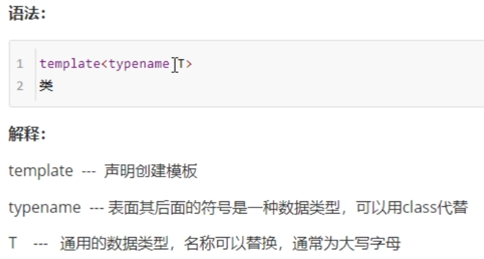  

函数模板：在这一行代码后面写个函数  
类模板：在这一行代码后面写个类  
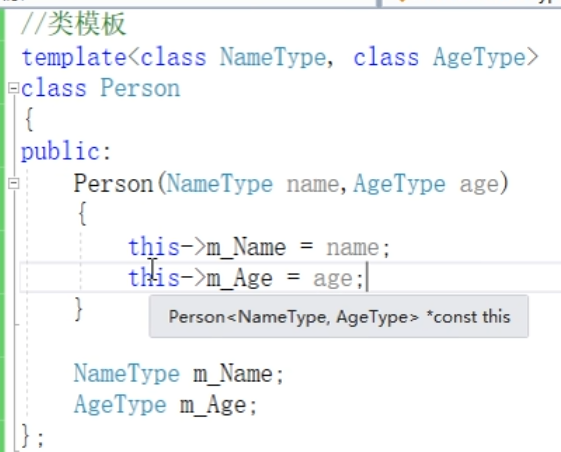  
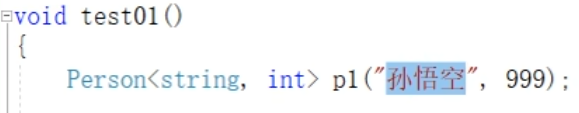  

模板参数列表，相当于将数据的类型————参数化  

***类模板和函数模板语法相似，在声明模板template后面加类，此类即为类模板***  

### 类模板与函数模板区别

1. 类模板没有自动类型推导的使用方式
2. 类模板在模板参数列表中，可以有默认参数

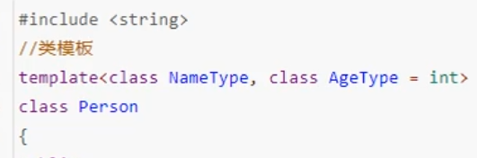  
  
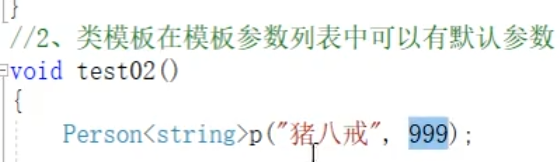  

### 类模板中成员函数创建时机

>普通类中成员函数一开始就可以创建  
>类模板中成员函数在调用时才创建

### 类模板对象做函数参数

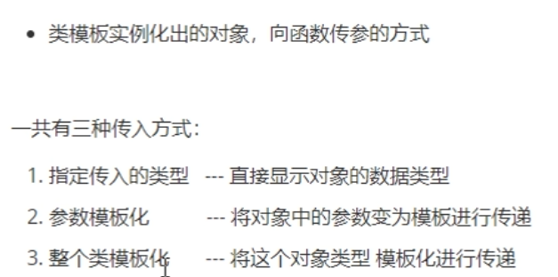  
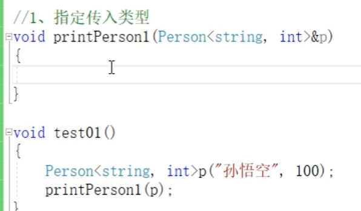  
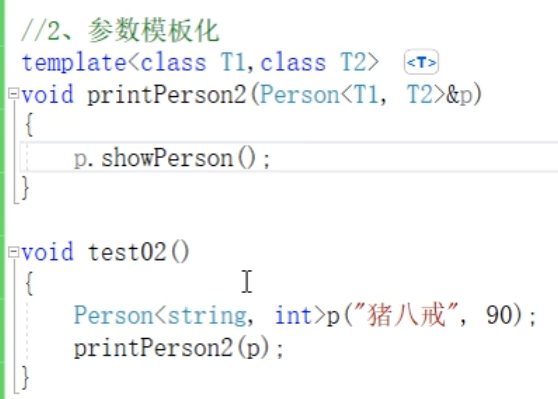  
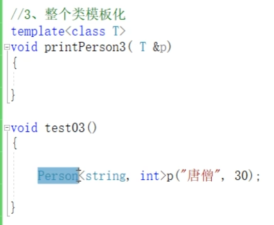  

***指定传入类型最常用***

### 类模板与继承

  
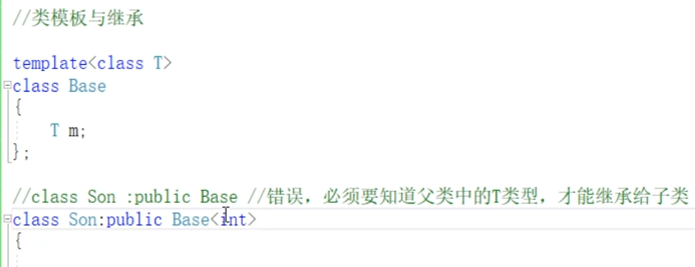  
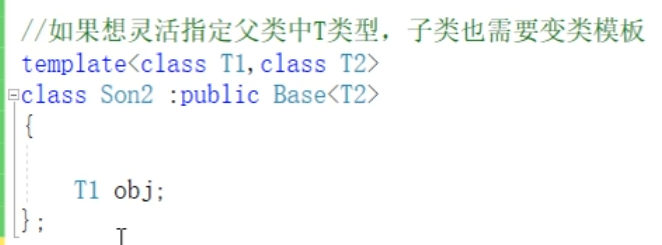  

***如果父类是类模板，子类需要指定出父类中T的类型***  

### 类模板成员函数类外实现

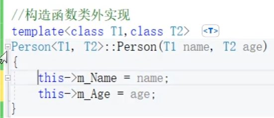  
类模板的构造函数类外实现  

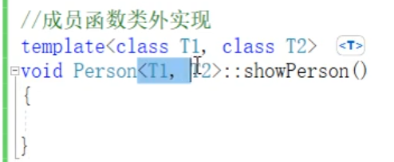

没有<...>就是普通的成员函数类外实现

***类模板的类外实现时，加上模板参数列表***

### 类模板分文件编写

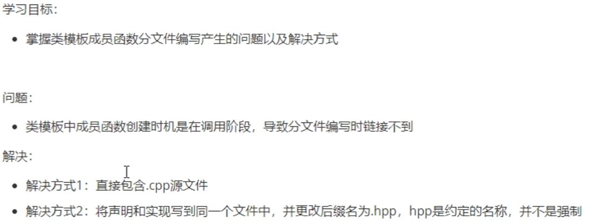  

### 类模板与友元

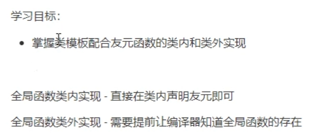  

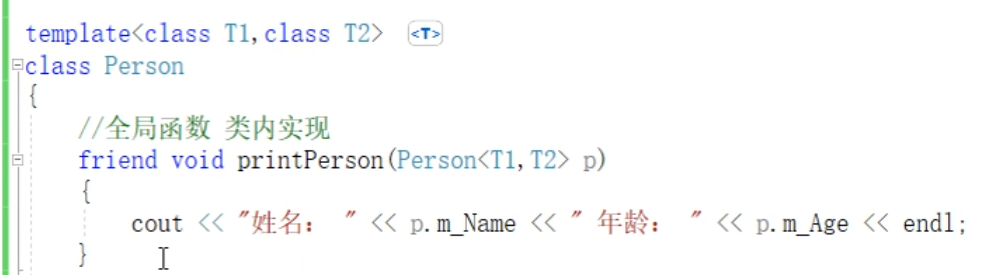  

***建议全局函数做类内实现，用法简单，而且编译器可以直接识别***  
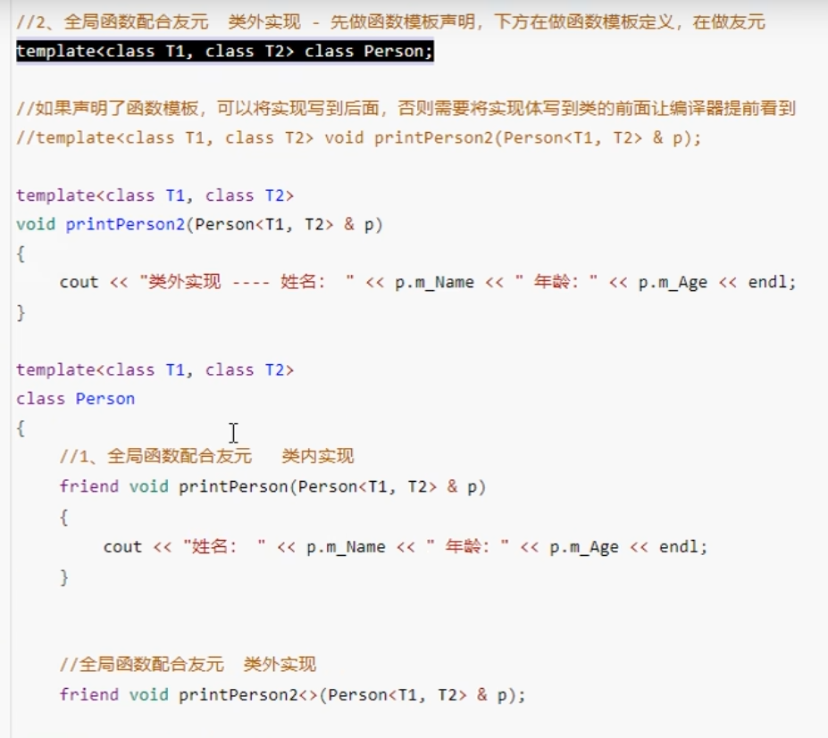  

