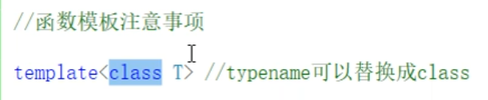
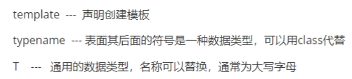
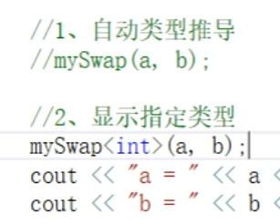
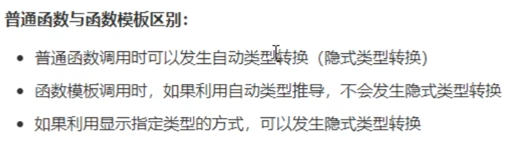
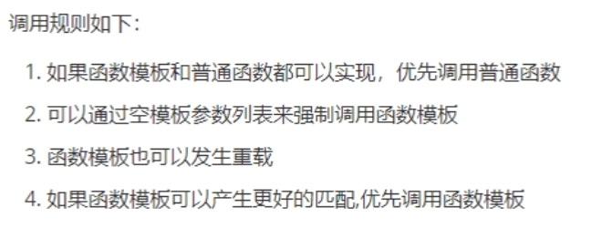
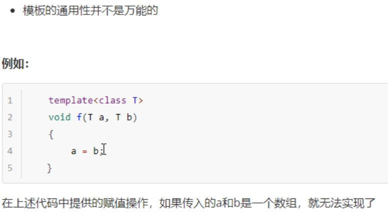
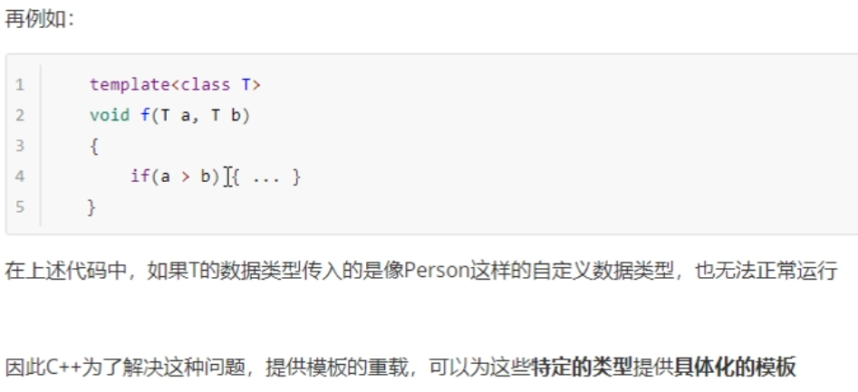
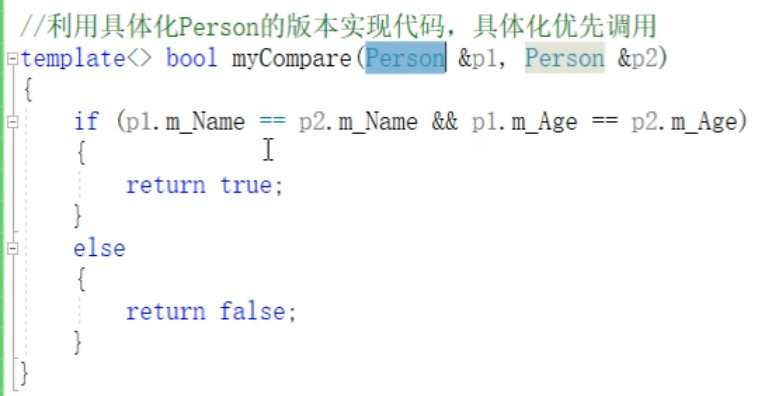

# 模板

enhance programming
针对C++泛型编程和STL技术

## 1 模板的概念

## 2 函数模板

建立一个通用的函数，其函数返回值类型和形参类型可以先不指定，用一个*虚拟类型*来代表  

    template<typename T>
    函数声明或定义

  

typename 或 class 都可以  

  

两种方式使用模板

1. 自动类型推导  
2. 显示指定类型

  

自动类型推导，必须推导出一致的数据类型才可以使用  
模板必须要确定出T 的数据类型，才可以使用。  
***即无论自动推导还是给定，一定要指定一致的数据类型***  

  
重点：能不能发生隐式类型转化  
普通函数：可以  
函数模板（自动类型推导，不可以；显示类型指定，可以）  

普通函数和函数模板是可以发生函数重载的  
  

空模板参数列表  
模板参数列表就是尖括号 空模板参数列表， 尖括号啥也不写  
myprint<>(a, b);  

***总结：既然提供函数模板，就不要再提供普通函数了***  

### 模板局限性

  
  

1. 运算符重载  
2. 利用具体化Person的版本实现代码，具体化优先调用  

加尖括号<>告诉他是具体化的函数模板  
  

***学习模板，不是为了写模板，而是在STL中能够运用系统提供的模板***  

